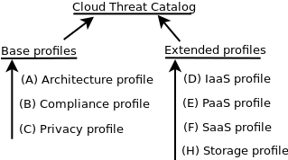
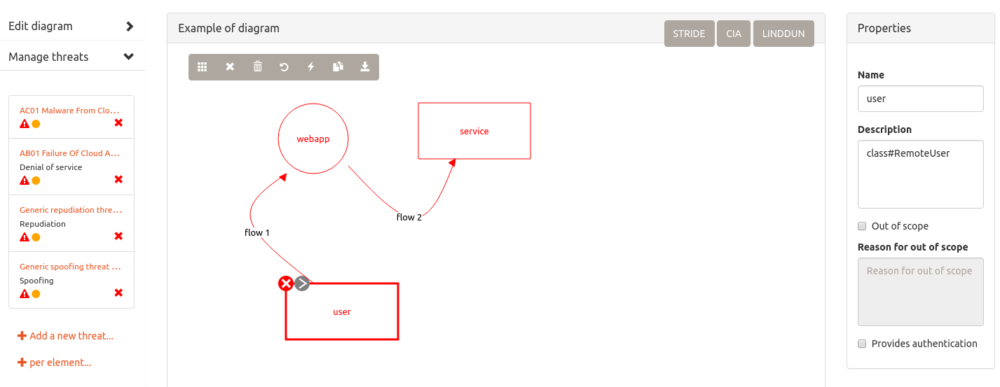

# Acadeimic Cloud Computing Threat Patterns (ACCTP) Model

This model is an ontological domain-specific threat model, 
which depicts common threats to cloud-based computer systems.

* [OWL file](../OdTMACCTP.owl)

It is automatically generated from the [ACCTP catalog](https://github.com/nets4geeks/SPCatalogMaker).

Proposed model of cloud computing environment contains a set of concepts, aimed to extend 
the base threat model with the cloud-specific entities.

Threat patterns are organized into three base and several extended profiles.

The architecture profile contains threats relate to a simple cloud system design, 
The compliance profile holds threats close to responsibilities of cloud actors, cloud environment, and legal issues. 
The privacy profile is about confidentiality of information and personal data. 
Extended profiles (IaaS, PaaS, SaaS, Storage) contain the threats of various types of cloud applications.

To use the ACCTP model, you should describe structure of cloud system by a Data Flow Diagram (DFD),
for example, with the [OWASP Threat Dragon](https://owasp.org/www-project-threat-dragon/) modelling tool.
Saved JSON file should be used as a source for our OdTMServer application /[see details here](../applications/OdTMServer/).
JSON file with a threat model, built by the OdTMServer tool, can be reopen in Threat Dragon for further analysis.

Here is an example of threat model opened in the threat modelling tool 
(at the moment we use the Description field to assign extra concepts with DFD items). 

