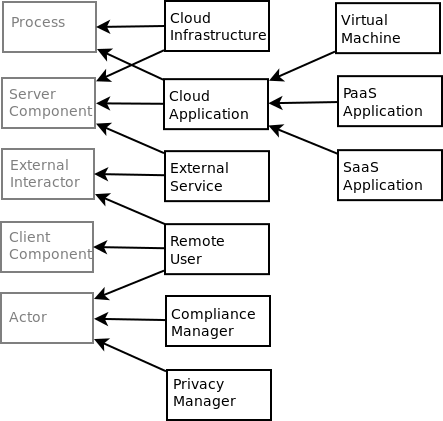

# Academic Cloud Computing Threat Patterns (ACCTP) Model

This model is an ontological domain-specific threat model, 
which depicts common threats to cloud-based computer systems.

* [OWL file](../OdTMACCTP.owl)

It is automatically generated from the [ACCTP catalog](https://nets4geeks.github.io/acctp/).

Here are [guide](../guide/README.md) how to use the ACCTP model and [instruction](../guide/instruction.md) how to create cloud-specific threat models.

Proposed model of cloud computing environment contains a set of concepts, aimed to extend 
the base threat model with the cloud-specific entities.



Cloud threat patterns are organized into three base and four extended profiles.


The architecture profile contains threats related to a simple cloud system design, 
The compliance profile holds threats close to responsibilities of cloud actors, cloud environment, and legal issues. 
The privacy profile is about confidentiality of information and personal data. 
Extended profiles (IaaS, PaaS, SaaS, Storage) contain the threats of various types of cloud applications.

To use the ACCTP model, you should describe structure of cloud system by a Data Flow Diagram (DFD) 
with the [OWASP Threat Dragon](https://owasp.org/www-project-threat-dragon/) modelling tool, applying the cloud specific labels to items of the diagram.
Saved Dragon's JSON file should be used as a source for our OdTMServer application [(see details in the instruction)](../guide/instruction.md).
JSON file with a threat model, built by the OdTMServer tool, can be reopen in Threat Dragon for further analysis.

Current list of the cloud specific labels includes:

```
class#CloudApplication
class#CloudInfrastructure
class#ComplianceManager
class#ExternalService
class#PaaSApplication
class#PrivacyManager
class#RemoteUser
class#SaaSApplication
class#VirtualMachine
```

