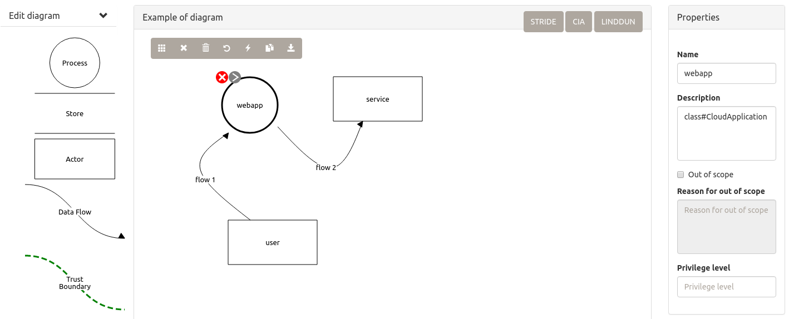
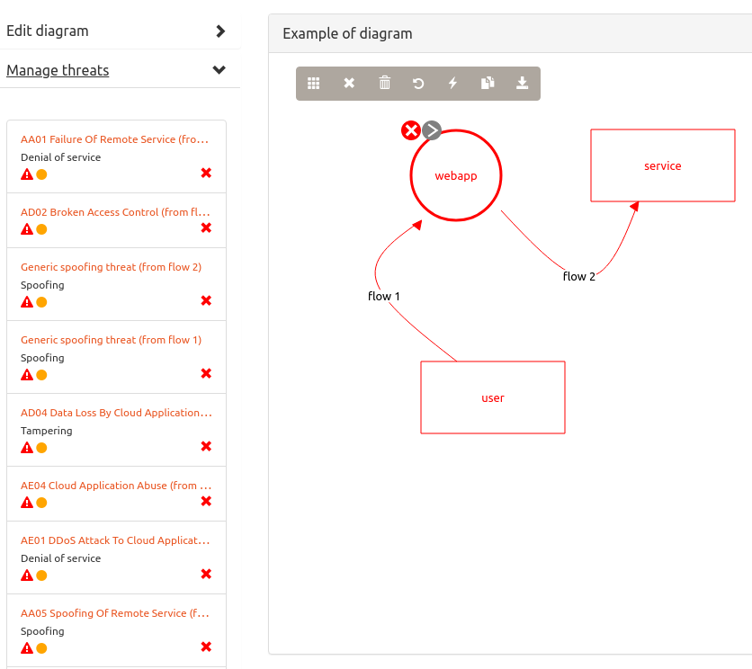

# How to create ontology-driven threat models

We are working on improvement of our software tools and their availability for wide audience.
However, building of ontology-driven threat models is a bit tedious at the moment.
We hope to enhance the usability on our own 
(also we welcome any initiative of creation tools for the ontology-driven threat modeling).

## Preparation

### Download and install the Threat Dragon tool

The [OWASP Threat Dragon](https://github.com/OWASP/threat-dragon-desktop/releases) desktop application 
is a well-known free, open-source, cross-platform threat modeling tool.
Use its [documentation](https://docs.threatdragon.org/) to learn the process of diagram management.

Threat Dragon has a built-in threat rule engine, supporting the STRIDE, CIA, LINDDUN techniques.
However, we use here the ontology-driven approach, based on domain-specific threat models, 
and implemented by the OdTMServer application.

### Download, compile and configure the OdTMServer application 

You need a **git client**, **java** & **maven**.

* *Clone the [OdTM git repository](https://github.com/nets4geeks/OdTM.git), go to the 'applications/OdTMServer' folder and compile it:*

```
mvn compile
```

* *Prepare a properties file for every diagram (use the 'server_acctp.properties' file in the OdTMServer folder as an example):*

```
BASEMODEL: ../../OdTMBaseThreatModel.owl
MODELS: ../../../SPCatalogMaker/schema/SecurityPatternCatalogNaiveSchema.owl, ../../../SPCatalogMaker/catalogs/acctp/catalog/common.owl, ../../../SPCatalogMaker/catalogs/acctp/catalog/ACCTPCatalog.owl, ../../OdTMACCTP.owl

DOMAINMODELIRI: http://www.grsu.by/net/OdTMACCTP
CLASSMODELIRI: http://www.grsu.by/net/ACCTP/common

TDFILE: cases/tdexample_acctp.json
TDOUT: cases/tdexample_acctp_modelled.json
```

The 'TDFILE' property describes a source JSON file, created by Threat Dragon, 
and 'TDOUT' points to a target JSON file with the ontological threat model.

For the cloud modeling you need files of several ontologies:

[OdTMBaseThreatModel.owl](../OdTMBaseThreatModel.owl) - the base threat model (the 'BASEMODEL' property) 

Other are items of the 'MODELS' property:

[SecurityPatternCatalogNaiveSchema.owl](https://github.com/nets4geeks/SPCatalogMaker/blob/master/schema/SecurityPatternCatalogNaiveSchema.owl) - the SP schema;

[common.owl](https://github.com/nets4geeks/SPCatalogMaker/blob/master/catalogs/acctp/catalog/common.owl) - the ACCTP common (class) model;

[ACCTPCatalog.owl](https://github.com/nets4geeks/SPCatalogMaker/blob/master/catalogs/acctp/catalog/ACCTPCatalog.owl) - the ACCTP target model;

[OdTMACCTP.owl](../OdTMACCTP.owl) - the ACCTP domain specific threat model.


* *Run a particular modelling with a command like*:

```
mvn -e exec:java -q -Dexec.mainClass="ab.run.consoleApplication" -Dexec.args="server_acctp.properties" 
```

where the last item is the properties file.

## Model creation

* *Use Threat Dragon to create a diagram, [like this](instruction_example.json):*



To enable cloud related threats, you should mark items by the labels from the ACCTP common model 
with the 'Description' field (the 'webapp' item belongs to the 'CloudApplication' class in the picture,
and user is labeled as 'class#RemoteUser', service has the 'class#ExternalService' label).

Current list of the labels includes:

```
class#CloudApplication
class#CloudInfrastructure
class#ComplianceManager
class#ExternalService
class#PaaSApplication
class#PrivacyManager
class#RemoteUser
class#SaaSApplication
class#VirtualMachine
```

* *Use Dragon's saved JSON file as a source ('TDFILE') of the OdTMServer console application to get a target JSON file ('TDOUT')*.

* *Load [the target JSON](instruction_example_modelled.json) to Threat Dragon:*



Now you can work with threats (apply mitigations, define severity or delete a threat).
