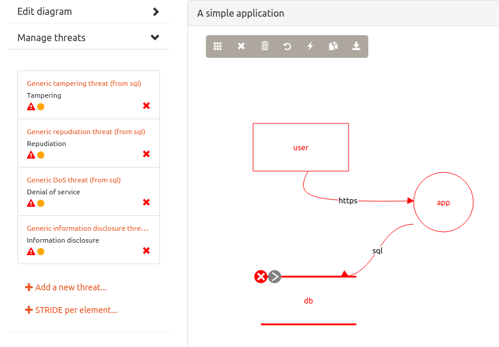
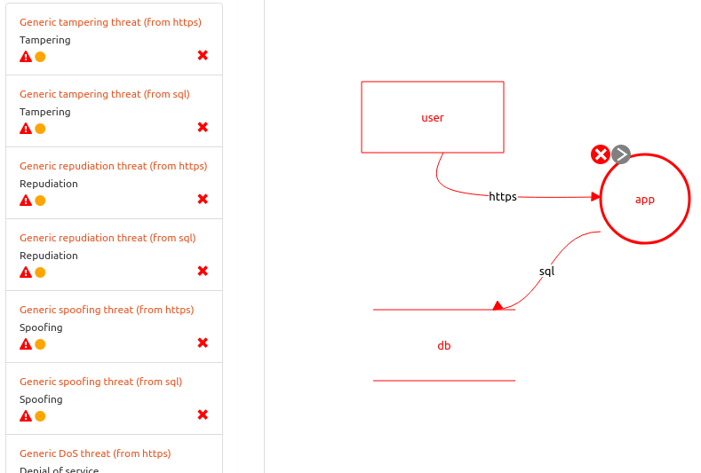
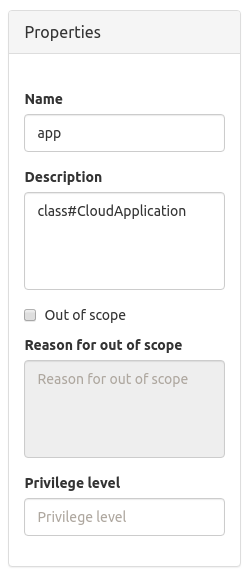
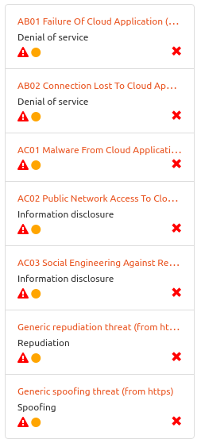

# Lab1: Introduction to the ontology-driven threat modeling

### Starting threat modeling...

The classic approach to threat modeling is based on [Data Flow Diagrams (DFD)](https://www.google.com/search?q=Shostack+A.+Experiences+Threat+Modeling+at+Microsoft).
Also several [other techniques](https://insights.sei.cmu.edu/sei_blog/2018/12/threat-modeling-12-available-methods.html) exist.

You can use the [OWASP Threat Dragon](https://github.com/OWASP/threat-dragon-desktop/releases) desktop application 
to manage threat models, apply mitigations, and create reports (there is [its documentation](https://docs.threatdragon.org/)).
Threat Dragon has a built-in threat rule engine, supporting the STRIDE, CIA, LINDDUN techniques.
However, we use here original ontology-driven approach, based on domain-specific threat models, 
and implemented by own [OdTMServer](instruction.md) application.

So, there is a simple computer system.
It includes a web application (process) and background database (storage).
Also, users of this system (external entities, or actors) should be taken into account.
A user communicates with the application by the HTTPS protocol, and the application and database interact by the SQL protocol.

To examine security aspects of the system, a simple DFD has been created:

After processing by OdTMServer, the [threat model](models/lab1_example1_modelled.json) (**Example1**) is like
(i.e. the 'db' item in the picture can be affected by the tampering, repudiation, denial of service, 
and information disclosure threats):

Also, it can be found, that the 'app' component has double number of the STRIDE threats, 
because it has two flows (for example, denial of service of 'app' can be caused by the 'user' item with the 'https' flow,
as well as by 'db' with 'sql'):

Note, the ontology-driven threat modelling framework is focused on the network communications.
Every data flow represents a network connection from a client (edge without arrow) to a server (edge with arrow).
Such a connection is bidirectional, and you do not have to create a flow from the server to client
(but this sort of traffic should be taken into account).

### ...and applying the cloud threats

Example1 (see above) shows how the ontological approach works. Our rule engine has 'taken' the STRIDE threats 
from the [base threat model](../docs/BASEMODEL.md), which is an OWL (Web Ontology Language) ontology. 
Actually, that has been a result of automatic reasoning of the semantic interpretation of DFD (ontology too), e.g. ABox (Assertion Box),
and the base threat model, e.g. TBox (Terminology Box).
An introduction to Ontology Engineering [can be found here](https://people.cs.uct.ac.za/~mkeet/OEbook/)
(if you were really interested in).

The STRIDE approach gives a generic view to security threats. Analysis of particular cases requires domain-specific knowledge
(for example, the threats that are specific to interaction between browser and web application 
or between web application and SQL database).
The ontology-driven approach gives such an opportunity by domain-specific threat models.
A domain-specific model contains typical components and threats, assigned to the flows between those components, for a paritical
kind of computer systems.

This guide depics a cloud threat model,
based on the [Academic Cloud Computing Catalog Patterns (ACCTP)](https://nets4geeks.github.io/acctp/) catalog.
We have created an ontological [domain-specific threat model](../docs/ODTMACCTP.md) from the ACCTP catalog.

With ACCTP it is possible to morph the common example of computer system to cloud specific.
To do so, the 'app' and 'db' items hav been labeled as 'class#CloudApplication' (see picture), 
and 'user' as 'class#RemoteUser. These concepts ('CloudApplication', 'RemoteUser') are parts of ACCTP.

After processing by OdTMServer, the items of the [threat model](models/lab1_example2_modelled.json) (**Example2**) 
have got a bunch of new threats. The 'user' item has the least threats:

Now you can work with cloud threats  (apply mitigations, define severity or delete a threat) using Threat Dragon.

## Assignments

## Self-testing

* What is threat modeling?
* What approaches are used for the threat modeling?
* Which items can a data flow diagram consist of?
* What is STRIDE?
* What benifits does STRIDE-per-element provide?

