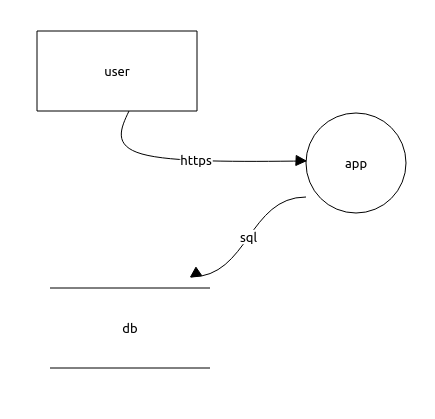

# Lab1: Introduction to the ontology-driven threat modeling

## Notes

### STRIDE & DFDs for threat modeling 

The classic approach to threat modeling is based on [Data Flow Diagrams (DFD)](https://www.google.com/search?q=Shostack+A.+Experiences+Threat+Modeling+at+Microsoft).
Also several [other techniques](https://insights.sei.cmu.edu/sei_blog/2018/12/threat-modeling-12-available-methods.html) exist.

You can use the [OWASP Threat Dragon](https://github.com/OWASP/threat-dragon-desktop/releases) desktop application 
to create diagrams (here is [its documentation](https://docs.threatdragon.org/).
Threat Dragon has a built-in threat rule engine, supporting the STRIDE, CIA, LINDDUN techniques.
However, we use here the ontology-driven approach, based on domain-specific threat models, 
and implemented by the [OdTMServer](instruction.md) application.

So, there is a simple computer system.
It includes a web application (process) and background database (storage).
Also, users of this system (external entities) should be taken into account.
A user communicates with the application by the HTTPS protocol,
and the application and database interact by the SQL protocol.

To examine security aspects of the system, a simple DFD has been created:

After the OdTMServer application processing, [the threat model](models/lab1_example1_modelled.json) is like
(for, example the 'db' item in the picture can be affected by the tampering, repudiation, denial of service, 
and information disclosure threats):

Also, it can be found, that the 'app' component has double number of the STRIDE threats, 
because it has two flows (for example, denial of service of 'app' can be caused by the 'user' item with the 'https' flow,
as well as by 'db' with 'sql'):

## Assignments

## Self-testing

* What is threat modeling?
* What approaches are used for the threat modeling?
* Which items can a data flow diagram consist of?
* What is STRIDE?
* What benifits does STRIDE-per-element provide?

