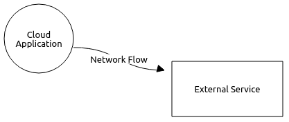

/ [main](README.md) /

# Lab2: Modeling of the cloud architecture threats

### Overview

The effective use of the cloud threat patterns requires some understanding of security issues 
and a bit of experience with design challenges.
We propose a set of design primitives to better tackle these challenges by inexpert users.
Learning these primitives in advance enables better understanding security aspects of a diagram 
that represents a whole design of a cloud system.

Three design primitives that touch the architecture aspects are described below.
The [ACCTP catalog](https://nets4geeks.github.io/acctp/catalog/) contains lists of threats corresponding to these primitives.

### Primitive1: Simple cloud application

The simplest use case of a cloud application is represented by interaction of remote users with the application.

From the network perspective remote users are treated as clients and the cloud application as a server.
And an application protocol (e.g. HTTPS) based on TCP/IP can be used for the data transmission.

The cloud application can affect remote users (as well as other entities acting as clients, like another cloud application or external service).
An example of common threats (the **ABxx** group in ACCTP) is [AB01 Failure Of Cloud Application](https://nets4geeks.github.io/acctp/catalog/threatAB01_FailureOfCloudApplication.html). 
The **ACxx** group represents threats specific to remote users, like [AC01 Malware From Cloud Application](https://nets4geeks.github.io/acctp/catalog/threatAC01_MalwareFromCloudApplication.html).

Clients (remote users, cloud applications, external services) can affect the cloud application.
The **ADxx** group contains common threats to cloud applications from those entities, like [AD01 Broken Authentication](https://nets4geeks.github.io/acctp/catalog/threatAD01_BrokenAuthentication.html).
And the **AExx** group is about the threats produced by remote users, like [AE01 DDoS Attack To Cloud Application](https://nets4geeks.github.io/acctp/catalog/threatAE01_DDoSAttackToCloudApplication.html).

A possible [threat model of Primitive1 is here](models/lab2_primitive1_modelled.json).

### Primitive2: Interaction of cloud applications

A cloud application often has several components, like frontend (web application) and backend (database or storage).
These components influence earch other from the security point of view.

The threats regarding this primitive are in the **ABxx** and **ADxx** groups (see examples above).

A possible [threat model of Primitive2 is here](models/lab2_primitive2_modelled.json).

### Primitive3: Interaction with external services

A cloud application can use services, described as external, i.e. "as it is" or with weak agreement between
a service and customer (network flow from the Cloud Application to the External Service).

This case (the use of the external service by the cloud application) is described by the **AAxx** group of threats.
An example can be [AA05 Spoofing Of Remote Service](https://nets4geeks.github.io/acctp/catalog/threatAA05_SpoofingOfRemoteService.html). 

And there is a case of the cloud application usage by an external service (External Service to Cloud Application).

The use of cloud applications is shown by the **ABxx** and **ADxx** groups, mentioned above. 

A possible [threat model of Primitive3 is here](models/lab2_primitive3_modelled.json).

## Assignments

* Using Threat Dragon, apply valuable mitigations (from your point of view) to the cloud specific threats of the 'Cloud Application' entity from [Primitive1](models/lab2_primitive1_modelled.json);
save a report as a PDF file. To find mitigations use the [ACCTP catalog](https://nets4geeks.github.io/acctp/catalog/) and other cloud security sources.

* Using Threat Dragon, apply valuable mitigations (from your point of view) to the cloud specific threats of the 'External Cloud Application' entity from [Primitive3](models/lab2_primitive3_modelled.json),
and apply valuable mitigations (from your point of view) to the cloud specific threats of 'Cloud API Service' caused by 'flow2' there. Save a report as a PDF file.

## Self-testing

* What are the main features of cloud services, considering as a definition of cloud?
* What well-known technologies are used to enable cloud computing?
* What are kinds of stakeholders in the cloud environment and kinds of cloud services according [NIST Cloud Computing Reference Architecture](https://nvlpubs.nist.gov/nistpubs/Legacy/SP/nistspecialpublication500-292.pdf)?
* What is the difference between the IaaS and PaaS cloud services?
* What are challenges of the user authentication?
* How to prevent cloud based applications from data breach?
* How to prevent cloud based services from data loss?
* How to prevent cloud based services from spoofing?
* How to prevent cloud based services from DDoS?

/ [main](README.md) /
